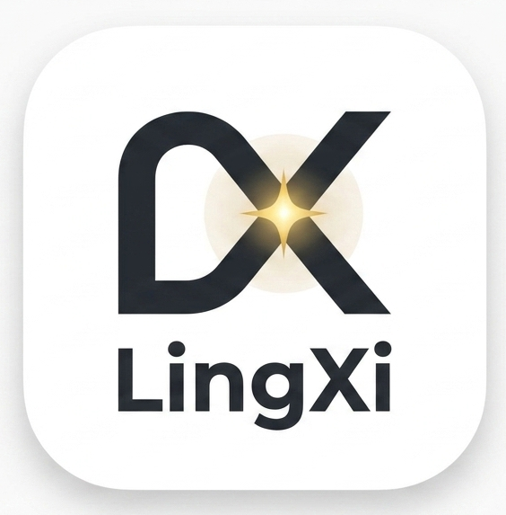

<p align="center">
  <a href="https://github.com/Swing-G/LingXi">
    <picture>
      <!-- TODO: 替换为实际 Logo 图片 -->
      <source srcset="assets/lingxi-logo.png">
      
    </picture>
  </a>
</p>

<p align="center">
  <strong>灵析 LingXi — 开发者技术互动平台</strong><br/>
  <sub>全栈开发 · 2025.09 - 2026.01</sub>
</p>

<p align="center">
  
  
  
  
  
  
  
  
</p>

---

## 项目简介

**灵析（LingXi）** 是一个面向开发者的技术社区平台，支持文章发布、互动计数、关注关系、首页 Feed 流推荐及文档智能问答。项目围绕**高并发 Feed 拉取**、**海量计数更新**与**多数据源一致性**等核心问题进行架构设计与性能优化。

> **在线体验**：http://117.72.216.56/  
> **代码仓库**：https://github.com/Swing-G/LingXi

<!-- 截图占位：首页 Feed 流全貌 -->
> 📸 **截图占位** — 首页全景

---

## 目录

- [一、项目亮点](#一项目亮点)
  - [1.1 Feed 流多级缓存](#11-feed-流多级缓存)
  - [1.2 关注链路解耦](#12-关注链路解耦)
  - [1.3 高并发互动计数](#13-高并发互动计数)
  - [1.4 RAG 问答与并发调度](#14-rag-问答与并发调度)
- [二、功能介绍](#二功能介绍)
  - [2.1 用户认证体系](#21-用户认证体系)
  - [2.2 知文创作与发布](#22-知文创作与发布)
  - [2.3 全文检索](#23-全文检索)
  - [2.4 RAG 智能问答](#24-rag-智能问答)
  - [2.5 社交互动](#25-社交互动)
  - [2.6 用户画像](#26-用户画像)
- [三、技术架构](#三技术架构)
- [四、技术栈](#四技术栈)
- [五、快速启动](#五快速启动)
- [六、项目结构](#六项目结构)
- [七、许可证](#七许可证)

---

## 一、项目亮点

### 1.1 Feed 流多级缓存

针对首页高频拉取场景，构建了 **Caffeine + Redis 三级缓存架构**，有效应对高并发流量冲击。

**架构设计**：

```
[客户端请求] → [Caffeine L2 本地缓存]  ← 命中即返回，微秒级
                  ↓ miss
              [Redis L1 页面/片段缓存]  ← 毫秒级，跨实例共享
                  ↓ miss
              [MySQL 数据库]  ← 兜底回源
```

| 组件 | 层级 | 用途 | 核心设计 |
|------|------|------|---------|
| **Caffeine** | L2 本地 | Feed 列表 / 知文详情 / 热 Key 缓存 | LRU + TTL + 窗口统计，极低延迟（μs 级） |
| **Redis** | L1 远程 | 页面级缓存 / 片段级缓存 | 分布式共享，按页面 + 分片维度缓存 |
| **HotKeyDetector** | 热 Key 探测 | 基于 Caffeine 访问频率统计，自动识别热点 | 可配置阈值，识别热点后叠加随机抖动 TTL，防止缓存雪崩 |
| **Single-flight** | 合并回源 | 同一 Key 的并发 miss 请求合并为一次 DB 查询 | 拦截瞬时并发回源风暴，避免 DB 被打爆 |

**设计亮点**：
- **三级缓存**：页面级 → 片段级 → 行级，按粒度逐级兜底
- **HotKey 探测**：内置频率统计 + 随机 TTL 抖动，防止热点缓存同时过期引发雪崩
- **Single-flight 机制**：相同 Key 并发 miss 仅触发一次 DB 查询，结果广播给所有等待方
- **缓存失效**：通过 `FeedCacheInvalidationListener` 在发布/编辑知文时精准失效相关 Feed 缓存

<!-- 截图占位：缓存架构图 + 命中率监控 -->
> 📸 **截图占位** — 三级缓存架构图

---

### 1.2 关注链路解耦

采用 **一主多从 + Outbox 事件驱动模式**，将核心写业务与异步旁路彻底解耦，保障数据最终一致性。

**架构全景**：

```
                        ┌─────────────────────────────┐
   [用户关注]  ──────→  │        同一本地事务            │
                        │  following/follower 写入     │
                        │       + Outbox 写入          │
                        └──────────┬──────────────────┘
                                   │ MySQL binlog 实时监听
                          ┌────────▼────────┐
                          │  Canal Server   │
                          │ (binlog 订阅)    │
                          └────────┬────────┘
                                   │ CanalKafkaBridge
                                   │ (SmartLifecycle)
                          ┌────────▼────────┐
                          │     Kafka       │
                          │  canal-outbox   │
                          └──┬───────────┬──┘
                             │           │
                    ┌────────┘           └────────┐
                    ▼                              ▼
        ┌──────────────────┐          ┌──────────────────┐
        │ Relation Consumer │          │  Search Consumer  │
        │ ┌──────────────┐ │          │ (ES 索引同步)      │
        │ │ follow 表写入  │ │          └──────────────────┘
        │ │ Redis ZSet 缓存│ │
        │ │ 用户计数更新   │ │
        │ └──────────────┘ │
        └──────────────────┘
```

**性能收益**：

| 指标 | 优化前 | 优化后 |
|------|--------|--------|
| 关注接口响应 | ~200ms（同步写库+缓存+通知） | **~20ms**（仅事务写库 + Outbox） |
| 数据一致性 | 弱一致（异步写缓存可能丢失） | **最终一致**（Canal binlog 回放保证） |
| 下游扩展性 | 耦合在主流程，新增下游需改业务代码 | **零侵入**，新增 Consumer 即可 |

**可靠性保障**：
- Canal 批次确认位点（`ack`），至少一次投递语义
- `CanalKafkaBridge` 实现 `SmartLifecycle`，Spring 启动时自动连接 Canal
- `SearchIndexInitializer` 启动检测 ES 索引为空时自动全量回填

<!-- 截图占位：关注链路解耦架构图 -->
> 📸 **截图占位** — Outbox + Canal + Kafka 架构全景

---

### 1.3 高并发互动计数

针对点赞、收藏等高频计数场景，设计了**异步写 + 写聚合**的削峰填谷架构，支撑单机 **1w+ TPS**，同时降低 **40% 内存开销**。

**数据结构设计（Redis）**：

| 键模式 | 类型 | 用途 | 内存优势 |
|--------|------|------|---------|
| `cnt:{schema}:{etype}:{eid}` | **SDS（定制化紧凑存储）** | 多维度计数（likeCount / favCount / shareCount） | 相比 Hash 结构降低 ~40% 内存 |
| `bf:{etype}:{eid}` | **Bitmap** | 用户操作状态（第 N 位 = 用户 N 是否已操作） | 每用户仅 1 bit，天然幂等 |
| `agg:{schema}:{etype}:{eid}` | Hash | 增量聚合桶 | 批量写入，定时刷入 SDS |

**三路径设计**：

```
【写路径 — 轻量异步】
[API] → [Bitmap SETBIT 原子判断+标记] → [Kafka 发送 CounterEvent]
                                                    ↓
【聚合路径 — 批量削峰】                     CounterAggregationConsumer
                                                    ↓
                                         [Redis Hash HINCRBY 聚合桶]
                                                    ↓
                                    [@Scheduled 每秒 → Lua 脚本]
                                         HGETALL → SDS 原子折叠 → DEL 聚合桶

【查询路径 — 直接读取】
[API] → [SDS 读最终计数] + [Bitmap GETBIT 查用户状态]
```

**关键指标**：

| 指标 | 数值 | 说明 |
|------|------|------|
| 单机 TPS | **1w+** | 写操作异步化，API 仅做 Bitmap + Kafka 投递 |
| 内存优化 | **-40%** | 定制化 SDS 紧凑存储替代原生 Hash |
| 幂等保证 | Bitmap 位操作 | 重复操作天然幂等，无需额外去重 |
| 原子性 | Lua 脚本 | Redis 服务端原子折叠，避免并发竞态 |

**容灾方案**：
- **Kafka 灾难回放**：计数丢失时可通过重放 Kafka 消息重建全部计数
- **自愈机制**：`CounterRebuildConsumer` 支持按需重建指定实体的计数快照
- **批量查询**：`getCountsBatch` 一次查询多个实体的多指标

<!-- 截图占位：计数系统三路径架构图 -->
> 📸 **截图占位** — 异步写 + 写聚合架构全景

---

### 1.4 RAG 问答与并发调度

基于 **Spring AI** 构建文档智能问答服务，通过**智能分块与预索引**优化知识库检索，引入 **Redis 信号量 + ZSET** 实现分布式队列限流与公平调度，平滑支撑大模型高并发请求。

**技术流程**：

```
[用户提问]
    │
    ▼
[智能分块] → 文章按语义边界切分为片段 → OpenAI Embedding 向量化 (1536维)
    │
    ▼
[预索引] → 发布时自动触发索引构建，首次问答时 ensureIndexed 兜底
    │
    ▼
[语义检索] → ES 向量相似度检索 + postId 过滤 → 取 Top-K 相关片段
    │
    ▼
[排队调度] → Redis 信号量 + ZSET 分布式公平队列
    │  ├─ 立即获取 → 直接回答
    │  ├─ 排队等待 → SSE 推送位置更新
    │  └─ 队列已满 → 友好拒绝
    │
    ▼
[DeepSeek Chat] → 基于检索上下文生成回答 → SSE 流式逐字推送
```

**排队调度机制**：

| 组件 | 技术 | 机制 |
|------|------|------|
| **并发控制** | Redis 信号量（Redisson） | 精确限制同时调用 LLM 的请求数 |
| **公平队列** | Redis ZSET | 按入队时间戳排序，先到先服务 |
| **实时反馈** | SSE | 排队位置 / 剩余等待数 / 获取槽位 / 超时 |
| **容错降级** | 多级 fallback | 429 限流 / Timeout / 401 认证 / 402 余额 → 具体中文提示 |

**SSE 事件流**：
```
event: queued    → {"position": 5}
event: position  → {"position": 3, "totalWaiting": 8}
event: position  → {"position": 1, "totalWaiting": 6}
event: ready     → {}                              ← 获取槽位
event: message   → "根据文章内容..."               ← 流式回答
event: done      → {}                              ← 完成
```

**设计亮点**：
- **智能分块**：按段落/标题边界切分，保持语义完整性
- **预索引**：发布时触发向量索引构建，用户首次提问无需等待
- **公平调度**：信号量 + ZSET 保证并发公平，避免饥饿
- **SSE 流式推送**：回答逐字输出，用户无需长时间等待

<!-- 截图占位：RAG 问答面板 + 排队 SSE 流 -->
> 📸 **截图占位** — RAG 问答全流程

---

## 二、功能介绍

### 2.1 用户认证体系

完整的无状态 JWT 认证体系，基于 Spring Security + OAuth2 Resource Server。

| 能力 | 说明 |
|------|------|
| **注册** | 手机号 + 验证码注册，BCrypt 强度 12 |
| **登录** | 密码登录 / 验证码登录双通道 |
| **JWT** | RS256 非对称加密，Access Token 15min + Refresh Token 7d，Redis 白名单 |
| **验证码** | 6 位数字，5min TTL，60s 发送间隔，日限 10 次 |
| **无感刷新** | 前端 AuthContext 60s 自动检查续期 |

<!-- 截图占位：登录 + 注册页 -->
> 📸 **截图占位** — 登录注册页面

---

### 2.2 知文创作与发布

支持草稿 → OSS 直传 → 编辑 → 发布 → 索引的完整内容生命周期。

```
[创建草稿] → [OSS 预签名直传] → [编辑元信息] → [发布] → [Outbox] → [ES 索引]
```

| 能力 | 说明 |
|------|------|
| **Markdown 编辑器** | 前端实时预览编辑 |
| **OSS 直传** | 预签名 URL 浏览器直传，不经过后端中转 |
| **AI 摘要** | DeepSeek Chat 自动生成描述摘要 |
| **可见性** | 公开 / 私有 / 好友可见 |
| **置顶** | 支持置顶管理 |

<!-- 截图占位：创作页 -->
> 📸 **截图占位** — 创作编辑页面

---

### 2.3 全文检索

基于 Elasticsearch 9.2.1，支持多字段匹配 + 标签过滤 + 搜索联想 + 深度分页。

| 能力 | 说明 |
|------|------|
| **关键词检索** | 标题 + 正文 + 标签多字段匹配 |
| **搜索联想** | Completion Suggester，输入即联想 |
| **游标分页** | `search_after` 深度分页，替代 `from+size` |
| **增量索引** | Canal Outbox 消费者，发布即索引 |
| **编码兼容** | 自动识别 UTF-8 / GB18030 |

<!-- 截图占位：搜索页 -->
> 📸 **截图占位** — 搜索结果页

---

### 2.4 RAG 智能问答

详见 [1.4 RAG 问答与并发调度](#14-rag-问答与并发调度)。

---

### 2.5 社交互动

**点赞 & 收藏**（详见 [1.3 高并发互动计数](#13-高并发互动计数)）：

| 能力 | API |
|------|-----|
| 点赞/取消点赞 | `POST /api/v1/action/like` / `unlike` |
| 收藏/取消收藏 | `POST /api/v1/action/fav` / `unfav` |
| 计数查询 | `GET /api/v1/counters/{etype}/{eid}` |

**关注 & 粉丝**（详见 [1.2 关注链路解耦](#12-关注链路解耦)）：

| 能力 | API |
|------|-----|
| 关注/取消关注 | `POST /api/v1/relations/follow/{userId}` / `unfollow` |
| 粉丝/关注列表 | `GET /api/v1/relations/followers` / `following` |

<!-- 截图占位：互动组件 -->
> 📸 **截图占位** — LikeFavBar + FollowButton 组件

---

### 2.6 用户画像

| 能力 | 说明 |
|------|------|
| **个人主页** | 用户信息 + 知文列表 |
| **资料编辑** | 昵称 / 简介 / 标签 / 学校 / 公司 |
| **头像上传** | OSS 预签名 URL 直传 |

---

## 三、技术架构

```
┌──────────────────────────────────────────────────────────────────────┐
│                            前端 (React 18)                            │
│                    React Router v6 · CSS Modules                      │
└────────────────────────────────┬─────────────────────────────────────┘
                                 │ REST API / SSE
┌────────────────────────────────▼─────────────────────────────────────┐
│                       Spring Boot 3.2.4 (Java 21)                     │
│  ┌──────────┬──────────┬──────────┬──────────┬──────────┬──────────┐ │
│  │  Auth    │ KnowPost │  Search  │ Relation │  Counter │   LLM    │ │
│  │ JWT/验证码 │ 知文CRUD │ ES全文检索│ 关注/粉丝 │ 点赞/收藏 │ RAG+排队 │ │
│  └──────────┴──────────┴──────────┴──────────┴──────────┴──────────┘ │
└────┬────────┬────────┬────────┬────────┬────────┬────────────────────┘
     │        │        │        │        │        │
┌────▼──┐ ┌──▼───┐ ┌──▼───┐ ┌──▼───┐ ┌──▼───┐ ┌──▼──────────┐
│ MySQL │ │Redis │ │  ES  │ │Kafka │ │Canal │ │ Alibaba OSS │
│  8.0  │ │ 8.4  │ │ 9.2  │ │ 4.1  │ │ 1.1  │ │ (文件存储)   │
└───────┘ └──────┘ └──────┘ └──────┘ └──────┘ └─────────────┘
```

**数据流**：
- **同步路径**：用户请求 → Controller → Service → MySQL（核心业务写入）
- **异步路径**：MySQL binlog → Canal → Kafka → Consumer → ES / Redis（索引与缓存同步）
- **计数路径**：API → Bitmap + Kafka → 聚合 Consumer → Redis SDS（高并发计数）

---

## 四、技术栈

| 层级 | 技术 | 说明 |
|------|------|------|
| **语言** | Java 21 | 虚拟线程支持 |
| **框架** | Spring Boot 3.2.4 | 核心框架 |
| **安全** | Spring Security + OAuth2 Resource Server | JWT RS256 无状态鉴权 |
| **ORM** | MyBatis 3.0.3 | SQL 映射 |
| **数据库** | MySQL 8.0 | 主存储 |
| **缓存** | Redis 8.4 + Redisson 3.52 + Caffeine 3.1.8 | 三级缓存 + 分布式锁 |
| **搜索** | Elasticsearch 9.2.1 | 全文检索 + 向量检索 |
| **消息** | Kafka 4.1 (KRaft) | 异步解耦 + 事件驱动 |
| **同步** | Canal 1.1.8 | MySQL binlog → Kafka |
| **AI** | Spring AI 1.0.3 + DeepSeek + OpenAI Embedding | RAG 问答 + 摘要生成 |
| **存储** | Alibaba OSS 3.17.3 | 文件对象存储 |
| **前端** | React 18 + TypeScript + Vite | SPA |
| **样式** | CSS Modules + CSS Custom Properties | 自定义设计系统 |

---

## 五、快速启动

### 环境要求

- JDK 21+ / Maven 3.6+ / Node.js 18+ / Docker & Compose

### 1. 启动中间件

```bash
docker compose up -d
docker compose ps   # 确认全部 healthy
```

### 2. 初始化数据库

```sql
CREATE DATABASE IF NOT EXISTS zhiguang DEFAULT CHARACTER SET utf8mb4;
SOURCE db/schema.sql;
```

### 3. 后端

```bash
cd zhiguang_be-main-new
# 配置 application.yml（数据库 / Redis / ES / DeepSeek API Key）
./mvnw clean compile
./mvnw spring-boot:run
```

### 4. 前端

```bash
cd zhiguang_fe-main-\ yuanban
npm install && npm run dev
```

访问 `http://localhost:5173`

---

## 六、项目结构

```
zhiguang/
├── zhiguang_be-main-new/                       # Spring Boot 后端
│   └── src/main/java/com/tongji/
│       ├── auth/                               # 认证（JWT / 验证码 / 安全配置）
│       ├── knowpost/                           # 知文（CRUD / 发布 / Feed）
│       ├── search/                             # 搜索（ES 全文检索 / 联想 / 索引管理）
│       ├── relation/                           # 关注（Outbox / Canal-Kafka Bridge / Redis 同步）
│       ├── counter/                            # 计数（Bitmap / SDS / Kafka 聚合 / Lua）
│       ├── llm/                                # AI（RAG 检索增强 / 排队限流 / 摘要生成）
│       ├── cache/                              # 缓存（Caffeine L2 / HotKey 探测 / Single-flight）
│       ├── profile/                            # 用户画像
│       ├── storage/                            # OSS 对象存储
│       ├── user/                               # 用户实体
│       └── common/                             # 异常处理 / 全局拦截
│
├── zhiguang_fe-main- yuanban/                  # React 前端
│   └── src/
│       ├── pages/                              # 页面（Home / Search / Create / Profile / Login ...）
│       ├── components/                         # 组件（CourseCard / SearchBar / LikeFavBar / Sidebar ...）
│       ├── context/AuthContext.tsx              # JWT 认证上下文（无感刷新）
│       ├── services/                           # API 服务层
│       └── theme/                              # 设计 Token
│
├── docker-compose.yml                          # 中间件编排
├── deploy.sh                                   # 一键部署脚本
├── DEPLOY.md                                   # 部署指南
├── es-config/                                  # ES 配置
└── canal-conf/                                 # Canal 配置
```

---

## 七、许可证

本项目基于 [MIT License](./LICENSE) 开源。

---

## 联系方式

- 在线体验：http://117.72.216.56/
- 代码仓库：https://github.com/Swing-G/LingXi
